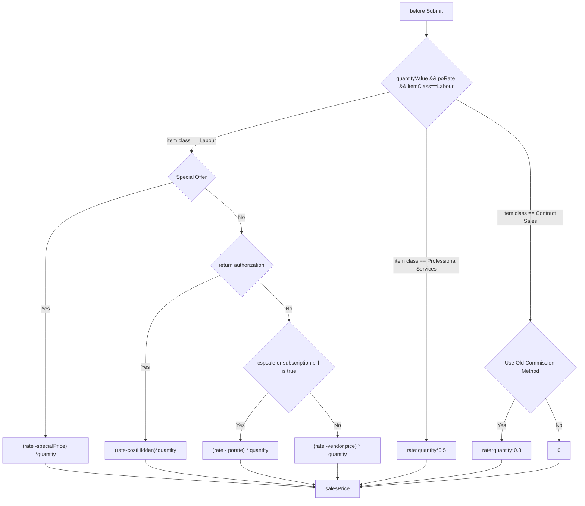

```mermaid
graph TD;
    A[before Submit] -->B
    B{quantityValue && poRate && itemClass==Labour }-->| item class == Labour| C{Special Offer} --> |Yes| D["(rate -specialPrice) *quantity"] -->E[salesPrice];
    C-->|No| F{return authorization}-->|Yes|G["(rate-costHidden)*quantity"] -->E;
    F-->|No|I{cspsale or subscription bill is true} -->|Yes|J["(rate - porate) * quantity"] -->E;
    I-->|No|H["(rate -vendor pice) * quantity"]-->E;
    B-->|item class == Professional Services| K[rate*quantity*0.5]-->E;
    B-->|item class == Contract Sales| L{"Use Old Commission Method	"} -->|Yes|M[rate*quantity*0.8]-->E;
    L-->|No|N[0] -->E
```
