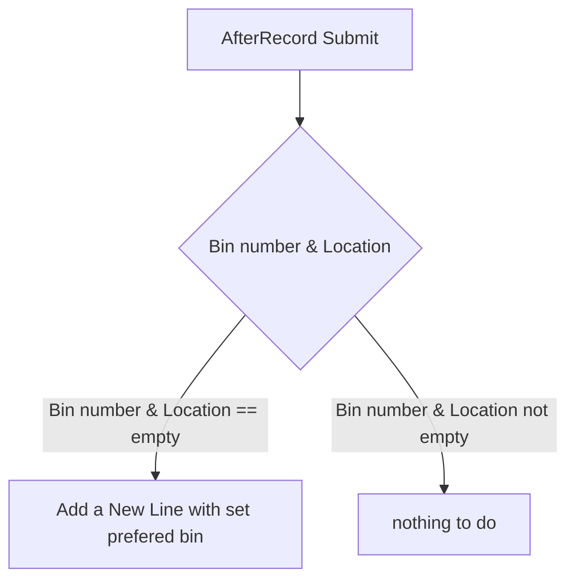
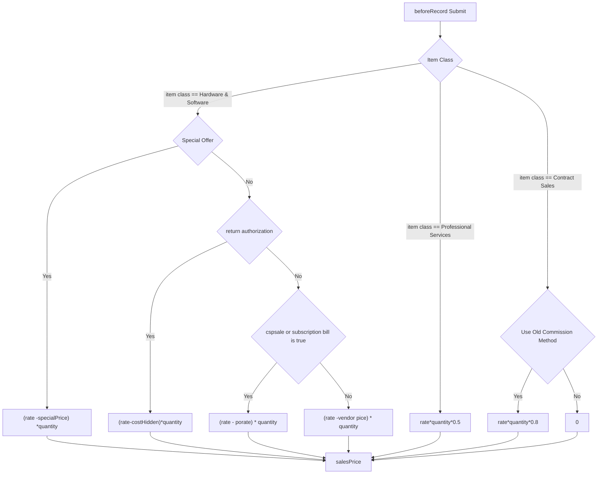

# :smile: Welcome  

# Documentation Map

- [:smile: Welcome](#smile-welcome)
- [Documentation Map](#documentation-map)
  - [Customer ](#customer-)
    - [DIS ](#dis-)
    - [Highlander ](#highlander-)
      - [**setPreferredBinUE**](#setpreferredbinue)
      - [**UserEventScript_Highlander_autoSalesPrice**](#usereventscript_highlander_autosalesprice)
      - [**customscript_kw_delivery_charge_ue**](#customscript_kw_delivery_charge_ue)
      - [**customscript_kw_hide_button_client**](#customscript_kw_hide_button_client)
    - [Artesian Spas ](#artesian-spas-)
      - [**customscript_kw_formulas_1**](#customscript_kw_formulas_1)
  - [Deployment ](#deployment-)
  - [Git ](#git-)
  - [Microsoft Team ](#microsoft-team-)
  - [:star: Support or Contact](#star-support-or-contact)

## Customer 

### DIS 

### Highlander 

#### **setPreferredBinUE**
Type | name | Id | script 
--- | --- | --- | ---
User Event | `Delivery Charge` | customscript_kw_delivery_charge_ue |   deliveryCharge.js

#### **UserEventScript_Highlander_autoSalesPrice**
Type | name | Id | script 
--- | --- | --- | ---
User Event | `Delivery Charge` | customscript_kw_delivery_charge_ue |   deliveryCharge.js

#### **customscript_kw_delivery_charge_ue**
Type | name | Id | script 
--- | --- | --- | ---
User Event | `Delivery Charge` | customscript_kw_delivery_charge_ue |   deliveryCharge.js

**how to deployment**
1. max __30__ parameters 
2. three different parameters id should start with **custscript_kw_delivery_item_**, **custscript_kw_form_** and **custscriptdelivery_charge_customer_**.  such as : custscript_kw_delivery_item_1 , custscript_kw_form_1, custscriptdelivery_charge_customer_1 . Then, please follow the sequences, such as custscript_kw_hide_button_2
3. choose the delivery item you wanna add into the record based on form id and customer id. please seperate the id by **space**

#### **customscript_kw_hide_button_client** 

Type | name | Id | script 
--- | --- | --- | ---
Workflow Action | hide Button Sublist | customscript_kw_hide_button |   hideButtonSublist.js

**how to deployment**
1. max 10 parameters
2. parameters id should start with **custscript_kw_hide_button_**,such as : custscript_kw_hide_button_1. Then, please follow the sequences, such as custscript_kw_hide_button_2
3. find a button id and fill in. for example, press ``ctrl + shfit + c`` in chrome browser, then find button id using cursor.

### Artesian Spas 

#### **customscript_kw_formulas_1**

Type | name | Id | script 
--- | --- | --- | ---
Client | `Novuna Finance Client` | customscript_kw_formulas_1 |  Client_kw_novuna_finance.js

**how to deployment**

1. add max 10 parameters
2. parameters id should start with custscript_hld_formula_,such as : custscript_hld_formula_ 1. Then, please follow the sequences, such as custscript_hld_formula_ 2
3. fill in formulas such as: custrecord_hl_hitfin_subsidyamount  = custrecord_hl_subsidy * custrecord_hl_nf_amount

## Deployment 

there are seperated document for deployment on Microsoft
1. [Email Capture](https://highlander.sharepoint.com/:w:/s/SystemsDevelopment/EbytszPke65Do6XMEPThXzABRtooxNNvVVkhhixQCO4QJA?e=uuWys4): capture email to create record 
- [ ] todo: more flexible for creating different records using same script

2. [IQBlade API](https://highlander.sharepoint.com/:w:/s/SystemsDevelopment/EbytszPke65Do6XMEPThXzABRtooxNNvVVkhhixQCO4QJA?e=uuWys4) : automatically generating customer Record Based on Company House Number

## Git 

this is a [seperated document link](git/git.md) for Git on Github

## Microsoft Team 

## :star: Support or Contact  

Having troble with Pages? Check out our [Q&A](q&a/index.md) or [contact support](https://highlanderuk.com/contact/) and we'll help you sort it out.

